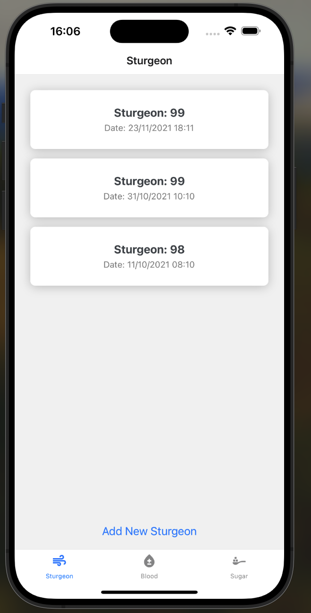

# Medical App

## Tech Stack

- React Native
- Typescript
- React-Navigation
- react-native-modal
- react-native-vector-icons
- react-native-community/datetimepicker

## What is this application?

This application is used for record our lovers medical records.

Sometime we record some blood pressure, sugar, sturgeon and more medical things. With this application, is easy then ever to record all those data!
You can get the data when you at the doctor, or at the hospital.

#### Our biggest advantage are

- No need to bring any paper anymore
- Nice and easy solution for does who have unread write hand (😅😅)

## Preview

